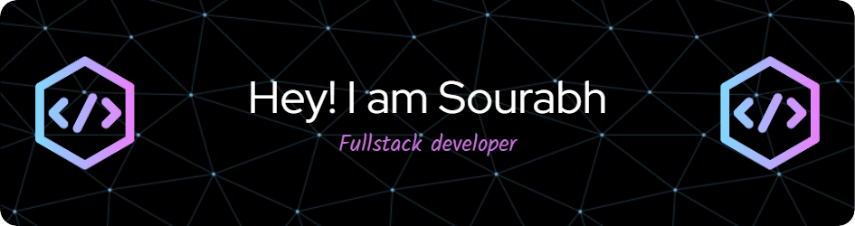

🔭 I’m currently working on: MERN Stack Projects & Next.js Applications

🌱 I’m currently learning: Advanced React, Backend Optimization & Cloud Deployment

👯 I’m looking to collaborate on: Full-Stack Projects, Startup Ideas & Open Source Contributions

🤔 I’m looking for help with: Scaling Applications & Backend System Design

💬 Ask me about: Web Development, MERN Stack, C++, JavaScript & Python

📫 How to reach me: saurabh.edusuccess@gmail.com

# 💻 Tech Stack:
               
# 📊 GitHub Stats:
 
 

## 🏆 GitHub Trophies

### ✍️ Random Dev Quote

### 🔝 Top Contributed Repo

---

<!-- Proudly created with GPRM ( https://gprm.itsvg.in ) -->ly_contributions=true)

---

<!-- Proudly created with GPRM ( https://gprm.itsvg.in ) -->
